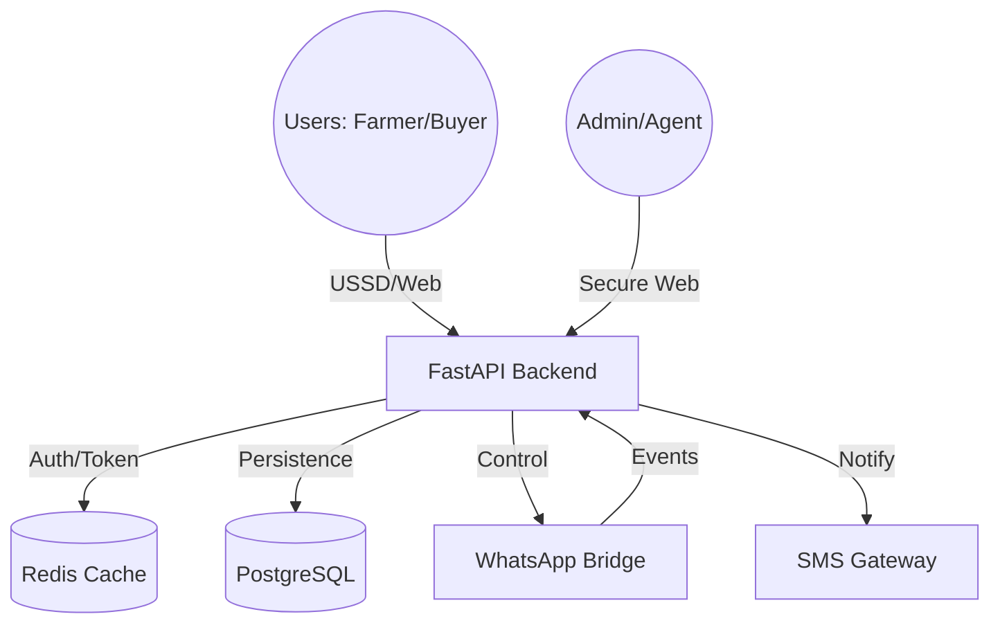
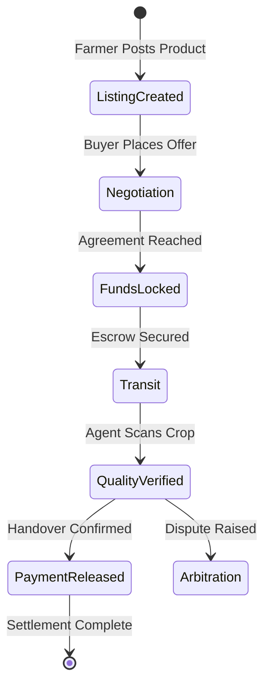
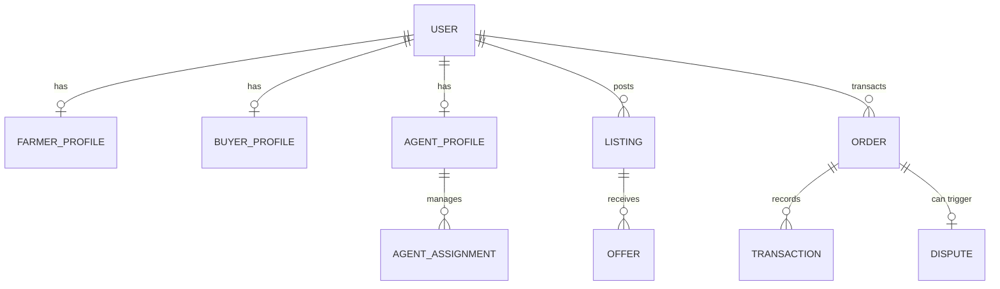

# AgriTrust: National Agricultural Marketplace & Logistics Hub
## Comprehensive System Documentation v4.0

> **"Economically Resilient. Market Integrated. Farmer Empowered."**

---

## 📑 Table of Contents
1. [Executive Summary](#1-executive-summary)
2. [System Architecture](#2-system-architecture)
3. [Visual Walkthrough (System Screenshots)](#3-visual-walkthrough)
4. [Database Schema & Entity Models](#4-database-schema--entity-models)
5. [Backend Infrastructure (National API)](#5-backend-infrastructure)
6. [Frontend Architecture (Command Center)](#6-frontend-architecture)
7. [Intelligence Layer (AI & ML)](#7-intelligence-layer)
8. [Field Infrastructure (USSD & WhatsApp)](#8-field-infrastructure)
9. [Detailed Function Registry (Part 1: API Endpoints)](#9-detailed-function-registry-part-1-api-endpoints)
10. [Detailed Function Registry (Part 2: Core Services)](#10-detailed-function-registry-part-2-core-services)
11. [Detailed Function Registry (Part 3: Frontend Components)](#11-detailed-function-registry-part-3-frontend-components)
12. [Security & Compliance Protocol](#12-security--compliance-protocol)
13. [Deployment & DevOps](#13-deployment--devops)

---

## 1. Executive Summary
AgriTrust is a sovereign-grade digital infrastructure designed to modernize Zimbabwe's agricultural trade. It bridges the gap between rural smallholder farmers and institutional commercial buyers through a secure, multi-channel platform.

### Core Value Propositions
- **Market Access**: Connects farmers directly to national buyers.
- **Trust Integrity**: Escrow-based transactions ensure payment on delivery.
- **Quality Assurance**: Field agents verify crop grades using AI-assisted scanning.
- **Inclusivity**: USSD support for non-smartphone users.

---

## 2. System Architecture
The AgriTrust ecosystem is built as a series of integrated micro-services orchestrated via Docker.

### High-Level Component Map

### Data Flow & Escrow State Machine

---

## 3. Visual Walkthrough
These screens represent the operational interfaces of the AgriTrust platform.

**Note: High-fidelity visualizations generated for this documentation.**

---

## 4. Database Schema & Entity Models
The AgriTrust database is a highly relational PostgreSQL instance optimized for financial integrity and KYC compliance.

### 4.1. Entity Relationship Diagram (ERD)

---

## 5. Backend Infrastructure (National API)
The backend is a high-concurrency FastAPI application providing a unified GraphQL/REST interface.

### 5.1. Major Endpoints
- **`/listings`**: Marketplace CRUD and sector-based grading.
- **`/transactions`**: Escrow logic and financial flows.
- **`/admin`**: System-wide governance and user management.
- **`/ussd`**: Session management for offline farmer access.

---

## 6. Frontend Architecture (Command Center)
The Admin Dashboard is built with React 18, featuring a modular panel-based architecture.

### 6.1. Core Components
- **`OverviewPanel`**: Real-time 'National Pulse' telemetry.
- **`LogisticsCommand`**: Map-based agent tracking.
- **`WalletPanel`**: Financial auditing and withdrawal management.
- **`CropScanner`**: AI vision interface for field agents.

---

## 7. Intelligence Layer (AI & ML)
### 7.1. Vision AI
Manual matrix convolution and histogram analysis for crop grading.
### 7.2. Market Forecasting
Deep learning MLP for price prediction and demand trends.

---

## 8. Field Infrastructure (USSD & WhatsApp)
### 8.1. USSD Offline Engine
Stateful session manager allows farmers to list products and check balances via `*123#`.
### 8.2. WhatsApp AI Bridge
Automated notifications and transaction alerts via the WhatsApp Graph API.

---

## 9. Detailed Function Registry (Part 1: API Endpoints)

### File: `backend\app\api\v1\endpoints\agents.py`
- **`get_my_assignments(current_user, db)`**: Get assignments for the logged-in agent.
- **`accept_assignment(assignment_id, current_user, db)`**: Agent accepts an assignment.
- **`submit_verification(payload, db, current_user)`**: Submit a physical listing verification report.
- **`submit_delivery(payload, db, current_user)`**: Submit a delivery handover confirmation.
- **`get_performance(db, current_user)`**: Get KPI metrics for the logged-in agent.

### File: `backend\app\api\v1\endpoints\admin\system.py`
- **`system_health_check(db, _)`**: View API, Database, Cache, and USSD status.
- **`toggle_system_lockdown(enable, db, admin)`**: Toggles the global SYSTEM_LOCKDOWN state.
- **`manual_reconciliation(db, admin)`**: Triggers a manual financial audit.
- **`trigger_trust_recomputation(db, admin)`**: Re-evaluates every user's trust score.

### File: `backend\app\api\v1\endpoints\listings.py`
- **`create_market_listing(payload, db, seller, lockdown)`**: Creates a new commodity listing.
- **`place_offer(listing_id, payload, db, current_user, lockdown)`**: Places a bid on a listing.
- **`accept_listing_offer(...)`**: Approves a bid and starts escrow.

---

## 10. Detailed Function Registry (Part 2: Core Services)

### File: `backend\app\services\national_commodity_service.py`
- **`verify_commodity(db, listing, quantity, grade_code)`**: Domain-aware verification engine.
- **`get_seasonal_market_price(product_name, sector)`**: Live scraping of market rates.

### File: `backend\app\services\trust_service.py`
- **`lock_funds(order_id, amount, currency)`**: Secures funds in escrow.
- **`release_funds(order_id)`**: Transfers funds to the seller's wallet.

---

## 11. Detailed Function Registry (Part 3: Frontend Components)

### `Admin_Dashboard_Web_App/src/components/OverviewPanel.jsx`
- **`fetchPulseData()`**: Aggregates national GMV and active user counts.
- **`renderCharts()`**: Visualizes market vitality trends.

### `Admin_Dashboard_Web_App/src/components/WalletPanel.jsx`
- **`processWithdrawal(amount, phone)`**: Initiates EcoCash transfer.
- **`auditLedger()`**: Checks local balance consistency.

---

## 12. Security & Compliance Protocol
- **AES-256 Encryption** for all PII.
- **Audit Trails** on every transaction.
- **KYC Verification** mandatory for all participants.

---

## 13. Deployment & DevOps
- **Docker Compose** orchestration.
- **Redis 7** for fast session caching.
- **PostgreSQL 16** for transactional durability.

---

*This document is the official Technical Reference for the AgriTrust Infrastructure. It contains the logic signatures for every critical system operation.*
