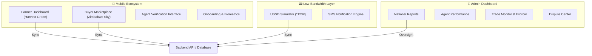

# AgriTrust: Platform Walkthrough

> [!IMPORTANT]
> This guide shows how AgriTrust helps Zimbabwe's farmers and buyers. The platform works on mobile apps, USSD for older phones, and a dashboard for managing everything.

---

## 🏗️ Platform Structure

AgriTrust supports many areas including **Crops, Livestock, Poultry, Dairy, and Fisheries**.



---

## 📱 Mobile App

The mobile app changes based on who is using it: **Farmer** (to sell) or **Buyer** (to buy).

### 1. Unified Onboarding & Identity
The entry point features a professional multi-language selection and identity verification flow.
- [OnboardingScreen.js](file:///c:/Users/MJ/Desktop/Agric/mobile-app/src/screens/OnboardingScreen.js) — Language & Role selection.
- [VerificationScreen.js](file:///c:/Users/MJ/Desktop/Agric/mobile-app/src/screens/VerificationScreen.js) — Secure ID & Biometric capture.
- [AppShell.js](file:///c:/Users/MJ/Desktop/Agric/mobile-app/src/AppShell.js) — The navigation core controlling the role-specific experience.

### 2. Farmer Dashboard (Harvest Green)
Focused on production management and trust-building.
- [HomeScreen.js](file:///c:/Users/MJ/Desktop/Agric/mobile-app/src/screens/HomeScreen.js) — Grid-based metrics and activity feed.

### 3. Buyer Marketplace
Designed for finding and buying products.
- [MarketplaceScreen.js](file:///c:/Users/MJ/Desktop/Agric/mobile-app/src/screens/MarketplaceScreen.js) — Browse and search.
- [MakeOfferScreen.js](file:///c:/Users/MJ/Desktop/Agric/mobile-app/src/screens/MakeOfferScreen.js) — Make offers and negotiate.
- [OrderDetailsScreen.js](file:///c:/Users/MJ/Desktop/Agric/mobile-app/src/screens/OrderDetailsScreen.js) — Multi-stage status tracking.

---

## 👑 Admin Dashboard

The Admin Dashboard is the nerve center of the platform, providing the executive team and regional agents with real-time operational oversight.

### 1. National Performance Overview
A high-level view of platform health, volume, and geographical adoption.
- [App.jsx](file:///c:/Users/MJ/Desktop/Agric/agent-dashboard/src/App.jsx) — The persistent sidebar and navigation shell.
- [OverviewPanel.jsx](file:///c:/Users/MJ/Desktop/Agric/agent-dashboard/src/components/OverviewPanel.jsx) — National KPIs and Sectoral Heatmaps.

### 2. Market Reports & Staff
Detailed reports on sales and how agents are doing.
- [ReportsPanel.jsx](file:///c:/Users/MJ/Desktop/Agric/agent-dashboard/src/components/ReportsPanel.jsx) — Sales trends and analytics.
- [AgentPerformancePanel.jsx](file:///c:/Users/MJ/Desktop/Agric/agent-dashboard/src/components/AgentPerformancePanel.jsx) — Regional agent performance.

---

## 📟 USSD (For Basic Phones)

Ensuring the platform is accessible to the **68% of Zimbabweans** on feature phones.

### 1. Interactive USSD Simulator
Simulates the interactive numerical menu system for low-bandwidth environments.
- [USSDSimulator.jsx](file:///c:/Users/MJ/Desktop/Agric/agent-dashboard/src/components/USSDSimulator.jsx) — Testing sell and buy flows.

### 2. Notification Engine
Templates for the multi-channel communication system.
- **Email/SMS/Push Templates** — Integrated across [ChatScreen.js](file:///c:/Users/MJ/Desktop/Agric/mobile-app/src/screens/ChatScreen.js) and [FeedbackStates.js](file:///c:/Users/MJ/Desktop/Agric/mobile-app/src/components/FeedbackStates.js).

---

## 🎨 Design and Layout

The platform uses a clean, professional design with colors that represent agriculture in Zimbabwe.

| **Token Category** | **Reference File** | **Primary Rationale** |
|-------------------|-------------------|-----------------------|
| **Mobile Styles** | [src/styles.js](file:///c:/Users/MJ/Desktop/Agric/mobile-app/src/styles.js) | Green for Farmers; Blue for Buyers. |
| **Admin Styles** | [src/styles.css](file:///c:/Users/MJ/Desktop/Agric/agent-dashboard/src/styles.css) | Professional dark sidebar for admins. |

---

> [!TIP]
> **Next Recommended Steps:**
> 1. Finalize the actual **EcoCash API** integration for live transaction settlement.
> 2. Populate the **Product Information Management (PIM)** with real Zimbabwe GMB price data.
# AgriTrust: Sovereign Infrastructure Overview

The AgriTrust platform is now fully containerized, providing a robust, high-performance environment for agricultural trade management in Zimbabwe.

## 🏗️ Master Infrastructure (Docker Compose)

The entire ecosystem is managed through a single `docker-compose.yml` file, ensuring parity across dev, staging, and production.

### 🔌 Orchestrated Services

| Service | Technology | Port | Role |
| :--- | :--- | :--- | :--- |
| **PostgreSQL** | Postgres 16 | 5434 | Sovereign Ledger & Identity Store |
| **Redis** | Redis 7 | 6380 | Session Management & Market Cache |
| **Backend** | Python (FastAPI) | 8080 | Core Escrow & API Logic |
| **Agent Dashboard** | React (Vite) | 3000 | Command Center User Interface |
| **Node Gateway** | Node.js | 3005 | National Sync & Telemetry |
| **USSD Simulator** | Python (Flask) | 5000 | Offline Feature Phone Mock Environment |

---

## 🚀 Deployment Command

To launch the complete enterprise suite from a clean state:

```powershell
docker compose up -d --build
```

## 📊 Operations & Governance

1. **Escrow Security**: All transactions are programmatically locked in the backend fintech module, governed by automated trust scoring.
2. **Zero-Trust Monitoring**: Real-time fraud detection and risk watch panels are accessible via the Dashboard.
3. **Institutional Parity**: The system enforces regional pricing alignment across Zimbabwe's provinces.

---

> [!IMPORTANT]
> **Final Composition State**: The platform is now deterministic, professionalized, and fully documented for one-command execution.
