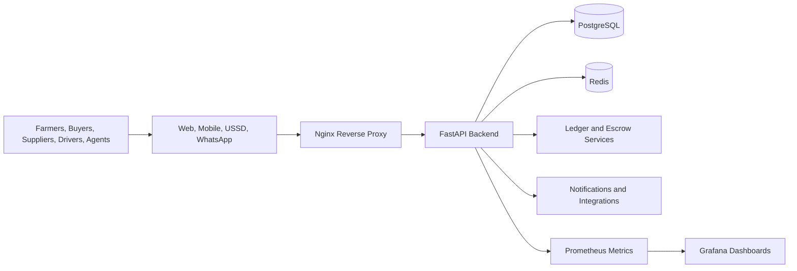

# ZimAgriTrust

ZimAgriTrust is a full-stack agricultural marketplace for farmers, buyers, suppliers, drivers, agents, and administrators. The platform combines web, mobile, USSD, WhatsApp, escrow, wallet, ledger, logistics, recruitment, governance, subscriptions, and compliance workflows in one monorepo.

## What's in the stack

- `backend/`: FastAPI service for authentication, marketplace flows, wallets, escrow, payments, logistics, governance, subscriptions, recruitment, and reporting
- `apps/admin-dashboard/`: Admin and command-center web portal
- `apps/agent-portal/`: Agent portal for certification, tasks, and verification
- `apps/app-portal/`: Farmer and buyer web portal
- `apps/public-website/`: Public browsing and discovery surface
- `apps/supplier-portal/`: Supplier commerce portal
- `apps/user-mobile/`: Expo mobile app for farmers and buyers
- `apps/driver-mobile/`: Expo mobile app for drivers
- `apps/whatsapp-bridge/`: WhatsApp integration bridge
- `apps/whatsapp-service/`: WhatsApp service process
- `apps/ussd-simulator/`: Local USSD flow simulator
- `apps/iot-gateway/`: Sensor and device integration layer
- `packages/shared/`: Shared frontend utilities and components
- `docs/`: Canonical documentation, architecture notes, and guides
- `data/`: Reference data, model assets, and seeded content
- `scripts/`: Utility scripts and maintenance tasks
- `monitoring/`: Grafana dashboards and Prometheus configuration for observability
- `nginx/`: Reverse proxy configuration for production deployment

## Core platform areas

- Marketplace listings, offers, orders, and settlement
- Supplier product catalog, inventory, and fulfillment
- Wallets, deposits, withdrawals, payouts, and ledger-backed balances
- Escrow release, refund handling, and dispute workflows
- Transport, driver assignment, and delivery confirmation
- Agent recruitment, onboarding, certification, and supervision
- Subscriptions, permissions, governance, and compliance
- Support tickets and issue tracking
- WhatsApp, USSD, SMS, and notification channels
- Multi-factor authentication (MFA) and security hardening

## Architecture at a glance



## Local run

The repository is designed to run with Docker Compose:

```powershell
docker-compose up -d --build
```

After the backend is healthy, run migrations:

```powershell
docker compose exec backend alembic upgrade head
```

## Production deployment

For production deployment, use the production Docker Compose configuration:

```powershell
docker-compose -f docker-compose.prod.yml up -d --build
```

See [PRODUCTION_DEPLOYMENT_GUIDE.md](./PRODUCTION_DEPLOYMENT_GUIDE.md) for detailed production deployment instructions.

## App ports

| App | Default port | Purpose |
|---|---:|---|
| Admin dashboard | `3001` | Admin and command-center operations |
| Agent portal | `3002` | Agent certification and workflow tools |
| Farmer and buyer web app | `3003` | Marketplace, wallet, and order flows |
| Public website | varies by setup | Public discovery and landing experience |
| Backend API | `8000` in app, often exposed as `8080` in Compose | API and OpenAPI docs |
| USSD simulator | `5000` | Local USSD testing |

Mobile apps are run from their own package folders with Expo commands.

## Documentation

- [docs/README.md](./docs/README.md)
- [QUICK_START.md](./QUICK_START.md)
- [PRODUCTION_DEPLOYMENT_GUIDE.md](./PRODUCTION_DEPLOYMENT_GUIDE.md)
- [SECURITY_VERIFICATION.md](./SECURITY_VERIFICATION.md)
- [docs/SECURITY_DATA_EXPOSURE_REVIEW.md](./docs/SECURITY_DATA_EXPOSURE_REVIEW.md)
- [docs/SECURITY_MONITORING_ALERTS.md](./docs/SECURITY_MONITORING_ALERTS.md)
- [docs/SECURITY_SECRET_ROTATION.md](./docs/SECURITY_SECRET_ROTATION.md)

## Project structure

```text
.
|-- apps/
|-- backend/
|-- config/
|-- data/
|-- docs/
|-- monitoring/
|-- nginx/
|-- packages/
|-- scripts/
`-- README.md
```

## Key features

- **Multi-platform access**: Web portals, mobile apps (Expo), USSD, and WhatsApp integration
- **Secure transactions**: Escrow-backed payments with dispute resolution
- **Comprehensive wallet system**: Deposits, withdrawals, payouts, and ledger accounting
- **Supplier commerce**: Product catalog, inventory management, and order fulfillment
- **Agent network**: Recruitment, certification, training, and supervision workflows
- **Logistics integration**: Driver assignment, delivery tracking, and transport negotiation
- **Governance & compliance**: Role-based permissions, subscriptions, and audit trails
- **Support system**: Ticket-based issue tracking and resolution
- **Observability**: Prometheus metrics and Grafana dashboards for monitoring
- **Production-ready**: Nginx reverse proxy, SSL/TLS support, and hardened security

## License

See [LICENSE](./LICENSE).
