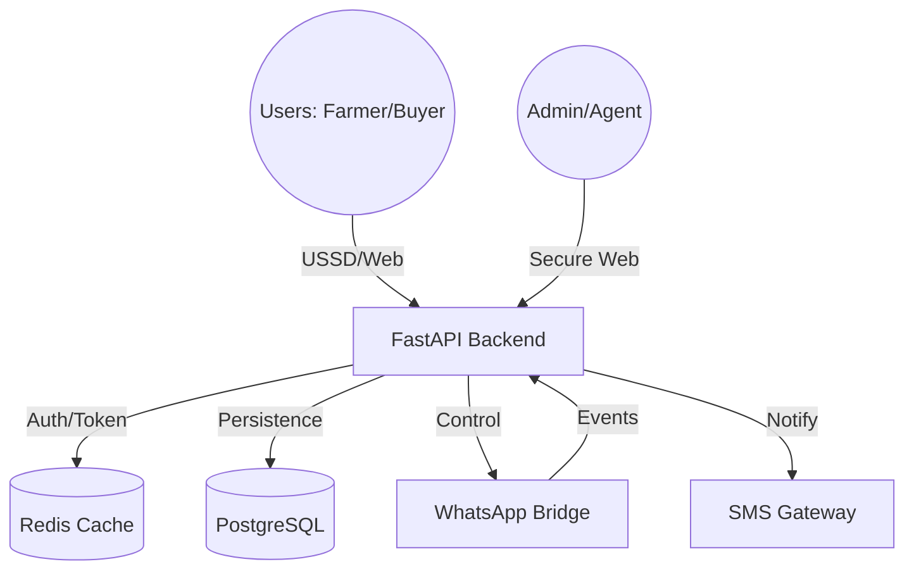
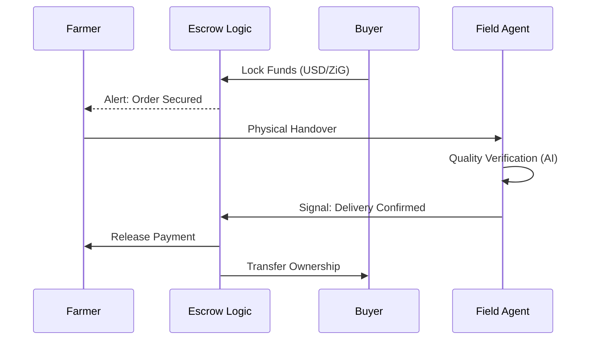
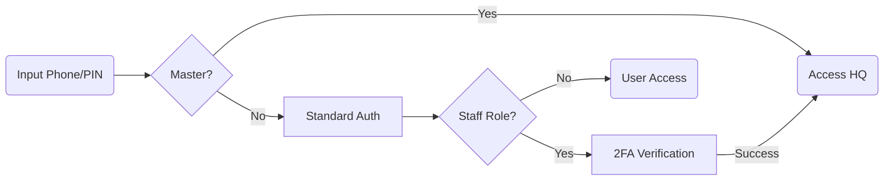
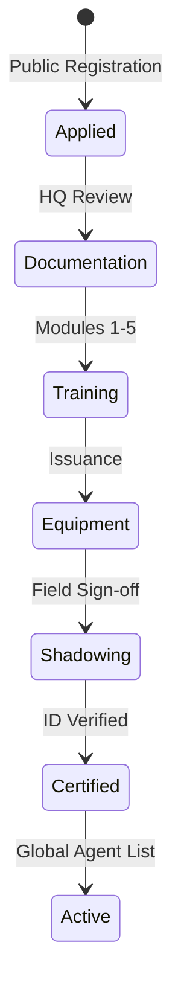

# AgriTrust: National Agricultural Marketplace & Logistics Hub

AgriTrust is a sovereign-grade digital infrastructure designed to modernize Zimbabwe's agricultural trade. It bridges the gap between rural smallholder farmers and institutional commercial buyers through a secure, multi-channel platform.


## 🚀 Key Evolutionary Features

*   **Offline-First USSD Engine**: Full marketplace accessibility via `*123#` integration, allowing farmers with basic feature phones to trade without data connectivity.
*   **Secure Escrow Nexus**: An automated financial layer that locks funds upon deal confirmation and releases them only after verified delivery, compatible with regional mobile money standards.
*   **WhatsApp AI Bridge**: Automated assistance and deal alerts via WhatsApp, allowing users to interact with the marketplace through their preferred messaging app.
*   **Regional Agent Network**: A decentralized network of verified Field Agents who manage logistical handovers, verify crop quality through AI-assisted scanning, and resolve disputes.
*   **Central Command (HQ)**: A high-performance administrative dashboard for monitoring national market vitality, GMV, and system health in real-time.

## 🛠️ System Architecture

The AgriTrust ecosystem is built as a series of integrated micro-services:

*   **`backend/`**: High-concurrency FastAPI core managing the ledger, authentication, and service orchestration.
*   **`Admin_Dashboard_Web_App/`**: A premium React 18 interface for HQ staff and Field Agents.
*   **`Whatsapp_Bridge/`**: A Node.js gateway that maintains secure persistent sessions with the WhatsApp network.
*   **`Telecom_USSD_Simulator/`**: A developer environment to test GSM-based USSD menus and session flows.
*   **`IoT_Sensor_Gateway/`**: Integration points for regional soil sensors and storage humidity monitors.

## 📊 System Visualizations

### 1. High-Level Architecture


### 2. Secure Transaction & Escrow Flow


### 3. Authentication & 2FA Protocol


### 4. Agent Recruitment Pipeline


## ⚙️ Technical Specifications

*   **Core**: Python 3.12 (Pydantic v2), FastAPI, Node.js 20.
*   **Persistence**: PostgreSQL 16 (Relational Ledger), Redis 7 (Speed & Session Cache).
*   **Security**: Professional-grade numeric **Security PINs** for all users, AES-256 session encryption, and 2FA for staff roles.
*   **DevOps**: Fully containerized using Docker Compose with automated health checks and restart policies.

## 🏁 Quick Deployment

To initialize the entire national agricultural trade stack:

```powershell
docker-compose up -d --build
```

### 🛰️ Access Nodes
| Node | URL | Purpose |
| :--- | :--- | :--- |
| **Command Center** | [http://localhost:3001](http://localhost:3001) | Main Admin/Agent Portal. |
| **National API** | [http://localhost:8080](http://localhost:8080) | Core Service & Swagger Docs. |
| **USSD Terminal** | [http://localhost:5000](http://localhost:5000) | Farmer Simulation Tool. |
| **WhatsApp Sync** | [http://localhost:3006/qr](http://localhost:3006/qr) | Mobile Bridge Linking. |

### 🔐 Initial Access Credentials
*   **Master Admin Phone**: `+263777777777`
*   **Master Admin PIN**: `master`
*   **Bootstrap Secret**: `agritrust-init-secret-2026` *(Required for new Staff/Agent registrations)*

---

*AgriTrust is engineered for economic resilience, market integrity, and the empowerment of the Zimbabwean farmer.*

🔗 **Lead Infrastructure Architect**: [Mathew Mabira](https://www.linkedin.com/in/mathew-mabira-24861632b)
