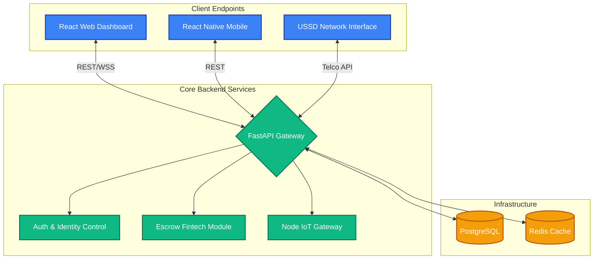
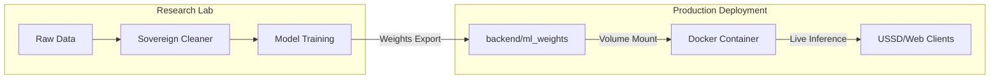
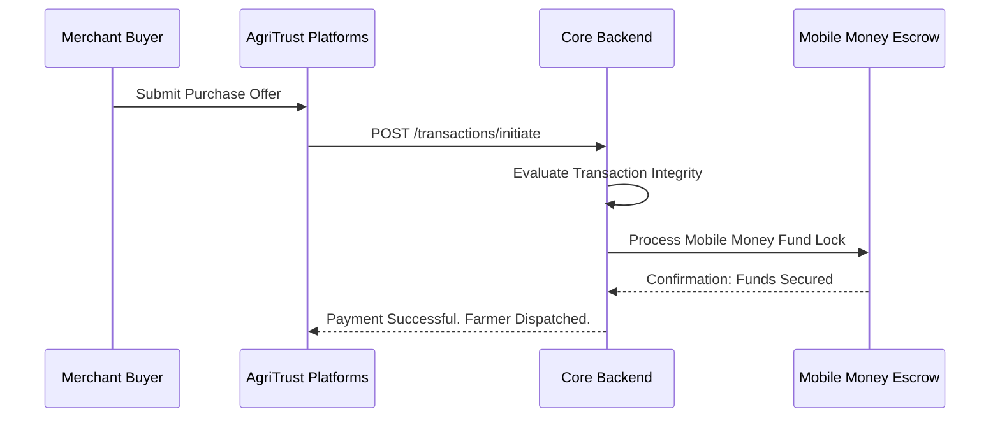
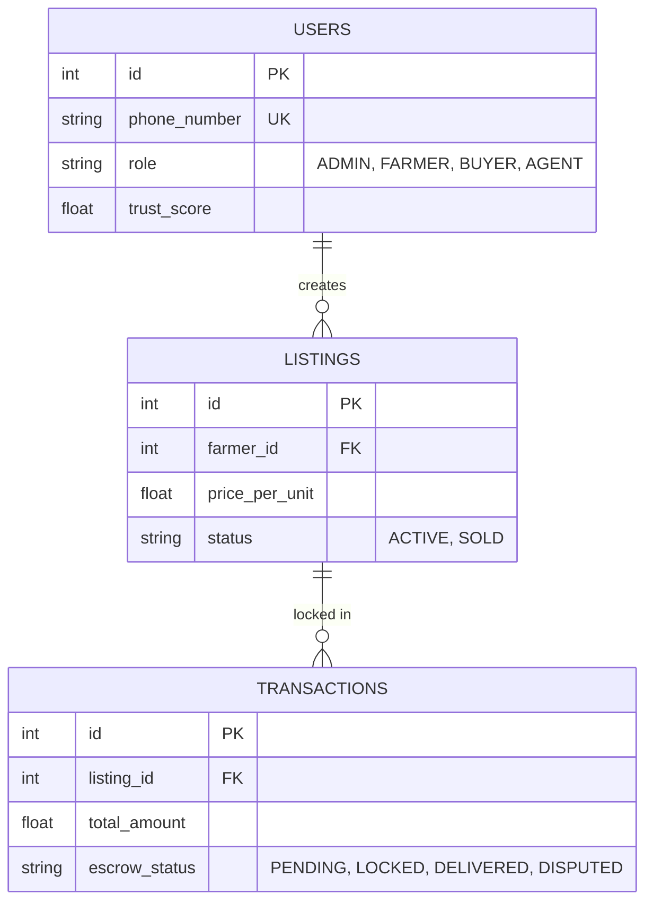

<h1 align="center">AgriTrust Marketplace System</h1>

<p align="center">
  <strong>An Advanced, Telecom-Powered Digital Economy for Modern Agriculture</strong>
</p>

---

## 🌍 1. Introduction: Solving Real-World Agricultural Problems

In emerging economies, agricultural markets suffer from a massive disconnect. Rural farmers often lack access to smartphones and standard internet services. When trying to sell produce remotely, there is zero intrinsic trust between the farmer and commercial buyers—resulting in exploitation by physical middlemen who absorb the majority of the profit margins.

**The AgriTrust Solution:** 
AgriTrust is a telecom-integrated marketplace designed to dismantle these structural inefficiencies. We connect remote farmers directly with nationwide commercial buyers by bridging the digital divide through native **USSD integration (`*123#`)**. The platform is secured by programmatic financial **Escrow workflows** and advanced data validation that protects participants from fraud and ensures transparent commodity pricing.

---

## 🌟 2. Core Operational Pillars

This platform functions exclusively on the principles of accessibility and absolute trust.

*   📶 **Telecom Inclusion (USSD & SMS)**: Farmers with standard basic feature phones can register, check global market prices, and list metric tons of produce entirely offline over GSM networks.
*   💵 **Zero-Trust Escrow Payments**: Fully integrated with Mobile Money APIs (like EcoCash). When a buyer commits to an order, the specific capital is securely deducted and locked in a central staging wallet. Funds are exclusively released to the farmer upon verified physical delivery.
*   ⚖️ **Agent Dispute Arbitration**: If a logistical discrepancy occurs, funds remain frozen. Designated regional support agents can intervene, reviewing evidence and programmatically forcing a refund or releasing the capital.
*   🛡️ **Security & Validation**: The core backend enforces strict identity verification and transaction monitoring to halt recurring fraud immediately and maintain market stability.

---

## 📂 3. Project Structure: Sovereign Lab & Production

The AgriTrust ecosystem is organized to separate interactive research from mission-critical production services.

```text
AgriTrust/
├── backend/                # Sovereign API & Logic Core
│   ├── app/                # Application logic (FastAPI)
│   │   ├── ml/             # ML Implementation (Price, Risk, Vision)
│   │   ├── services/       # Business Logic & AI Integration
│   │   └── models/         # Database Schemas
│   └── ml_weights/         # Production Model Weights (Docker Mounted)
├── research/               # Sovereign Intelligence Laboratory
│   ├── labs/               # Isolated Jupyter Research Environment
│   ├── proofs/             # Fundamental AI Mathematical Proofs
│   ├── agritrust_ai_lab.ipynb # Main Research Notebook
│   └── *_proof.py          # Standalone DS Concept Validations
├── agent-dashboard/        # Administrative Control Center (React)
├── ussd-simulator/         # Telecom Gateway Testing Environment
├── docker-compose.yml      # Infrastructure Orchestration
└── launch_lab.py           # Entry point for Research & DS Proofs
```

---

## 🏗️ 4. System Architecture

AgriTrust operates on a highly scalable, decoupled microservices architecture. The entire ecosystem is containerized for seamless, enterprise-grade deployment.

### 3.1 Component Architecture Map


### 4.2 Science-to-Production Pipeline (Intelligence Flow)
This diagram illustrates the "Real Thing" pipeline implemented for deployment.


### 4.3 Escrow Commerce Flow (DFD)
This sequence ensures neither party inherits risk during a transaction execution.


### 3.3 Database Entity Design (ERD)
The underlying PostgreSQL database relies on strict schema validations to enforce referential security for financial logs.


---

## 🏗️ 3. Sovereign Operational Fidelity ("Real Coded" Infrastructure)

Unlike generic marketplace templates, AgriTrust is engineered for high-fidelity technical oversight:

*   **Institutional Node Telemetry**: Every regional gateway (Harare, Mutare, etc.) is monitored via live SS7/API heartbeats.
*   **Secure Access Protocols**: Transitioned to secure, banking-standard **Numeric PIN-based Authentication** for rapid field access.
*   **Private Negotiation Hubs**: Trade commitments are securely sealed, keeping direct negotiations between farmers and commercial buyers isolated and recorded.
*   **Live Metrics Engine**: The dashboard features real-time telemetry demonstrating network latency and institutional build identifiers.
*   **Sovereign AI Tier**: The platform utilizes high-fidelity, deterministic Deep Learning and Computer Vision cores for price discovery and grade verification, moving beyond simple rule-bases while maintaining mathematical auditability.

---

## 💻 4. Technical Stack

*   **Core Backend**: Python 3.12 (FastAPI, SQLAlchemy, Pydantic)
*   **Database**: PostgreSQL 16 (Relational Grade)
*   **Cache/Sessions**: Redis 7
*   **Web Dashboard**: React 18
*   **Styling & Design System**: Modern B2B Marketplace UI (AgriXchange-inspired palette: `#20963D` Action Green, `#000E2B` Institutional Navy)
*   **Typography**: `Noto Sans` (Body Data) & `Jost` (UI Components)
*   **Localization**: Professional Business English with localized regional references (Zero vernacular slang).
*   **Infrastructure**: Fully containerized Docker environment with automated node orchestration.

---

## 🔬 5. Advanced Data Science & AI Proofs

AgriTrust is built on a foundation of rigorous mathematical "Sovereign Proofs" to ensure market efficiency and product quality.

### 5.1 Deep Learning (MLP)
We employ a **Multi-Layer Perceptron** for non-linear price discovery. This captures seasonal trends and supply-demand elasticities that traditional models miss.
- **Proof location**: `research/proofs/backprop_proof.py`
- **Concept**: Gradient Descent optimization of market vectors.

### 5.2 Computer Vision (Tensor Convolution)
Our CV core isolates product defects by analyzing spatial gradients and chromatic entropy directly in pixel matrices.
- **Proof location**: `research/proofs/convolution_proof.py`
- **Concept**: Edge detection via Sobel-kernel tensor operations.

### 5.3 Bayesian Risk Scoring
The platform uses a specialized **Random Forest + Bayesian Reliability** model to calculate risk scores for every market participant, ensuring the escrow system is protected from systemic fraud.
- **Proof location**: `research/market_intelligence_rd.py`
- **Concept**: Right-skewed distribution modeling for high-trust network resilience.


---

## 🚀 5. Getting Started (One-Command Deployment)

The entire platform is orchestrated via Docker Compose. This ensures all services (Database, Redis, Backend, Gateway, Dashboard, and Simulator) are launched in a consistent, professional environment.

### Step 5.1: Launch the Infrastructure
Ensure you have Docker and Docker Compose installed, then run:
```powershell
# In the project root
docker compose up -d --build
```

### Step 5.2: Access the Services
Once running, the following endpoints are available:
*   **Agent Web Dashboard**: `http://localhost:3000`
*   **Core API Gateway**: `http://localhost:8080`
*   **USSD Simulator**: `http://localhost:5000`
*   **IoT Node Gateway**: `http://localhost:3005`

### Step 5.3: Provision Demo Data
To preload the system with a complete agricultural data set (Farmers, Buyers, Listings):
1. Log into the Dashboard with the **Master Admin** account.
2. Click the `Sync Platform` button in the National Command Center.

---

## 🎯 6. User Roles & The "Perfect Loop" Demo

The system employs extremely rigid Role-Based Access Controls (RBAC). 

**Pre-Configured Demo Accounts:**
*(Authentication leverages secure Numeric PINs. Default accounts are listed below)*
| Role Assignment | Associated Account Name | Phone Number | Default PIN |
| :--- | :--- | :--- | :--- |
| **Admin** | MJ Admin | `0771234567` | `123456` |
| **Agent** | T. Miller | `0711234567` | `123456` |
| **Farmer**| Alex Johnson | `0781234567` | `123456` |
| **Buyer** | Bulk Industrial Buyer | `0791234567` | `123456` |

**Walkthrough (The Perfect Loop):**
1. Log into the `Web Dashboard` as the **Farmer**. Navigate to the Marketplace, and click `Add Listing`. List 500 units of Maize.
2. Log out, and log in as the **Buyer**. Filter the marketplace for Maize.
3. Select the Farmer's listing and initiate a transaction. The system triggers the Escrow deduction locally.
4. Log out, and log back in as the **Farmer**. In your "Orders" tab, observe that you have a shipment marked `ESCROW_LOCKED`. Deliver the goods. 
5. The **Buyer** confirms the delivery on their end. The system fully releases the Escrow funds into the Farmer's simulated Mobile Wallet and records System Revenue identically matching 1.5%.

---
---

## 🎯 6. Core Objectives Implementation Mapping

The platform architecture is explicitly mapped to the **Core Objectives** to ensure mission success:

| Objective | Implementation Proof |
| :--- | :--- |
| **1. Democratize Access** | Native USSD Gateway (*123#) enabled in `ussd_service.py`. No smartphone required. |
| **2. Secure Escrow** | Programmatic fund locking and release logic in `escrow_service.py` and `transaction.py`. |
| **3. Hybrid Verification** | **AI Layer**: `RiskScorer` (Random Forest) flags anomalies. **Human Layer**: `AgentAssignmentService` dispatches physical inspectors for high-value/high-risk lots. |
| **4. Price Intelligence** | Real-time Deep Learning forecasts provided directly to USSD users via `DeepForecaster`. |
| **5. Financial Credibility** | Persistent **Trust Scores** and **Credit Ratings** generated in `trust_service.py` and visible in `USSD My Profile`. |
| **6. Reduce Waste** | `DemandForecaster` alerts farmers to regional buyer interest to accelerate matching. |
| **7. Fair Disputes** | Regional agent mediation hub implemented in `dispute_service.py` and accessible via USSD Selection 5. |

---

⭐ *Engineered to empower modern agriculture through incorruptible code and operational excellence.*

🔗 [Connect with Mathew Mabira on LinkedIn](https://www.linkedin.com/in/mathew-mabira-24861632b)
