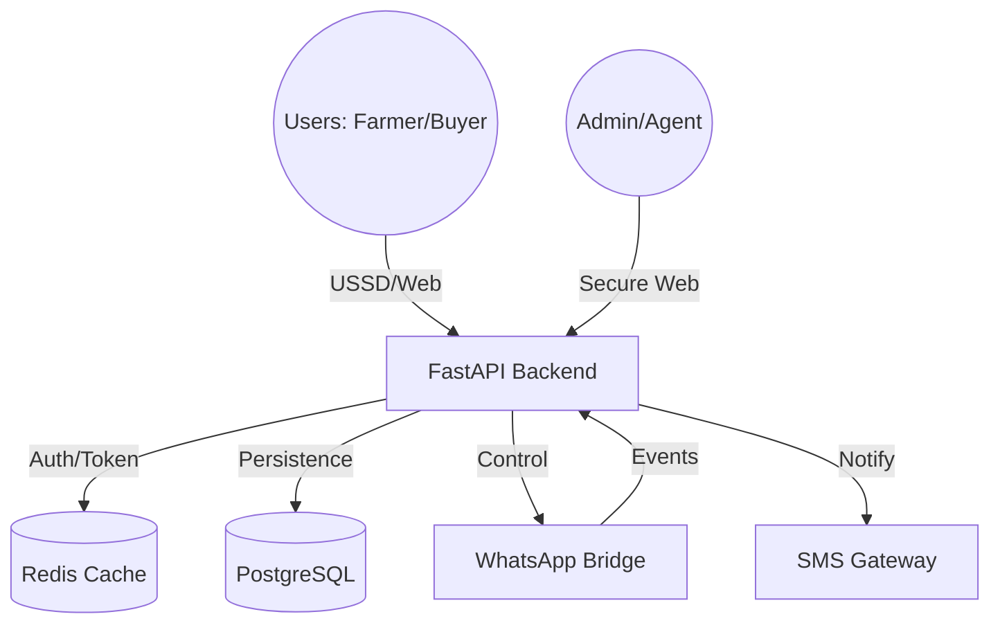
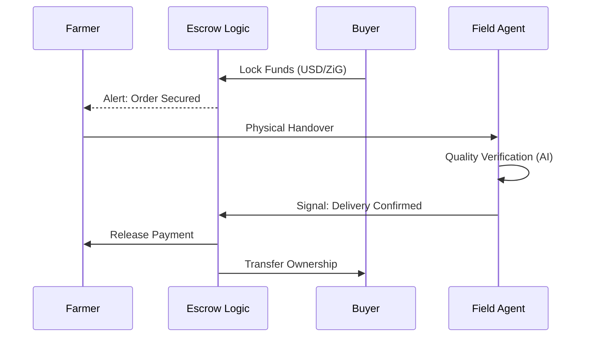
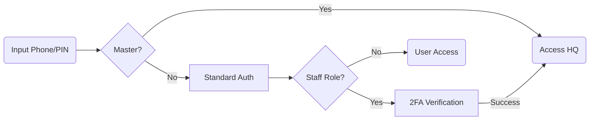
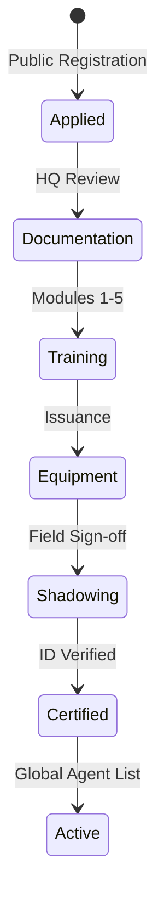
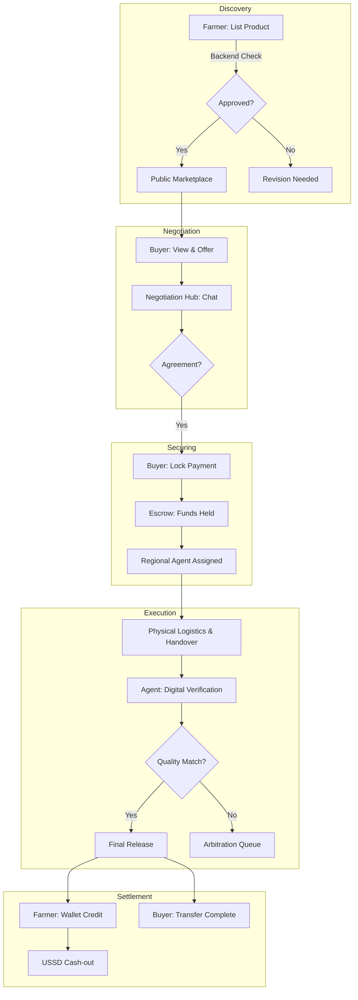
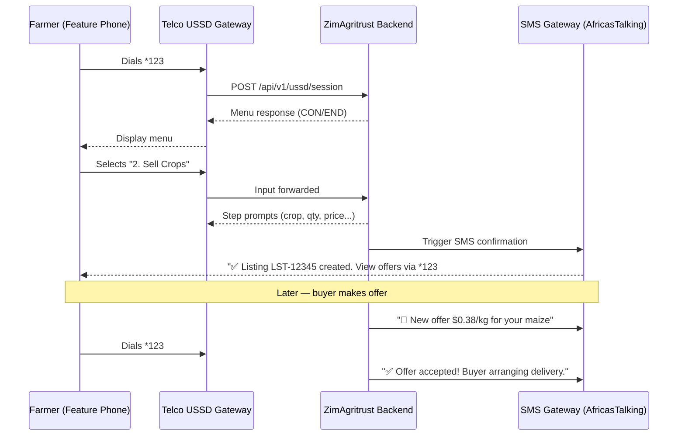

# ZimAgritrust: National Agricultural Marketplace & Logistics Hub

ZimAgritrust is a sovereign-grade digital infrastructure designed to modernize Zimbabwe's agricultural trade. It bridges the gap between rural smallholder farmers and institutional commercial buyers through a secure, multi-channel platform.


## 🚀 Key Evolutionary Features

*   **Offline-First USSD Engine**: Full marketplace accessibility via `*123#` integration, allowing farmers with basic feature phones to trade without data connectivity.
*   **Secure Escrow Nexus**: An automated financial layer that locks funds upon deal confirmation and releases them only after verified delivery, compatible with regional mobile money standards.
*   **WhatsApp AI Bridge**: Automated assistance and deal alerts via WhatsApp, allowing users to interact with the marketplace through their preferred messaging app.
*   **Regional Agent Network**: A decentralized network of verified Field Agents who manage logistical handovers, verify crop quality through AI-assisted scanning, and resolve disputes.
*   **Central Command (HQ)**: A high-performance administrative dashboard for monitoring national market vitality, GMV, and system health in real-time.

## 🛠️ System Architecture

The ZimAgritrust ecosystem is built as a series of integrated micro-services:

*   **`backend/`**: High-concurrency FastAPI core managing the ledger, authentication, and service orchestration.
*   **`apps/admin-dashboard/`**: A premium React 18 interface for Admin, Super Admin, and Regional Manager staff only.
*   **`apps/agent-portal/`**: Web-only training, task, verification, and dispute portal for certified Field Agents.
*   **`apps/app-portal/`**: Responsive web app for Farmers and Buyers after secure login.
*   **`apps/user-mobile/`**: Unified Expo mobile app for Farmers and Buyers on Android and iOS.
*   **`apps/driver-mobile/`**: Separate Expo mobile app for Drivers on Android and iOS.
*   **`apps/whatsapp-bridge/`**: A Node.js gateway that maintains secure persistent sessions with the WhatsApp network.
*   **`apps/ussd-simulator/`**: A developer environment to test GSM-based USSD menus and session flows.
*   **`apps/iot-gateway/`**: Integration points for regional soil sensors and storage humidity monitors.
*   **`apps/mobile/` and `apps/web/`**: Legacy/reference folders. Active apps are listed above.

## 📊 System Visualizations

### 1. High-Level Architecture


### 2. Secure Transaction & Escrow Flow


### 3. Authentication & 2FA Protocol


### 4. Agent Recruitment Pipeline


### 5. End-to-End Transaction Lifecycle


## ⚙️ Technical Specifications

*   **Core**: Python 3.12 (Pydantic v2), FastAPI, Node.js 20.
*   **Persistence**: PostgreSQL 16 (Relational Ledger), Redis 7 (Speed & Session Cache).
*   **Security**: Professional-grade numeric **Security PINs** for all users, AES-256 session encryption, and 2FA for staff roles.
*   **DevOps**: Fully containerized using Docker Compose with automated health checks and restart policies.

## 🏁 Quick Deployment

To initialize the entire national agricultural trade stack:

```powershell
docker-compose up -d --build
```

Run database migrations after the backend is healthy:

```powershell
docker compose exec backend alembic upgrade head
```

### Current Application Split
| App | URL | Intended users |
| :--- | :--- | :--- |
| Public website | [http://localhost:3000](http://localhost:3000) | Guests, public browsing, signup/login entry |
| Farmer/Buyer web app | [http://localhost:3003](http://localhost:3003) | Farmers and Buyers only |
| Admin portal | [http://localhost:3001](http://localhost:3001) | Admin, Super Admin, Regional Manager only |
| Agent portal | [http://localhost:3002](http://localhost:3002) | Agents only |
| User mobile app | Docker service `user-mobile` | Farmers and Buyers on Android/iOS |
| Driver mobile app | Docker service `driver-mobile` | Drivers only |
| Backend API | [http://localhost:8080](http://localhost:8080) | FastAPI services and Swagger docs |
| USSD simulator | [http://localhost:5000](http://localhost:5000) | Developer USSD testing |

Mobile apps use project-local commands, so you do not need global `expo` or `eas` installs:

```powershell
cd apps\user-mobile
npm run start
npm run build:android
npm run build:ios

cd ..\driver-mobile
npm run start
npm run build:android
npm run build:ios
```

### 🛰️ Access Nodes
| Node | URL | Purpose |
| :--- | :--- | :--- |
| **Command Center** | [http://localhost:3001](http://localhost:3001) | Admin portal only. |
| **Agent Portal** | [http://localhost:3002](http://localhost:3002) | Agent academy, tasks, and verification. |
| **Farmer/Buyer Web App** | [http://localhost:3003](http://localhost:3003) | Public-user dashboards and marketplace actions. |
| **National API** | [http://localhost:8080](http://localhost:8080) | Core Service & Swagger Docs. |
| **USSD Terminal** | [http://localhost:5000](http://localhost:5000) | Farmer Simulation Tool. |
| **WhatsApp Sync** | [http://localhost:3006/qr](http://localhost:3006/qr) | Mobile Bridge Linking. |

### 🔐 Initial Access Credentials
*   **Master Admin Phone**: `+263777777777`
*   **Master Admin PIN**: `master`
*   **Bootstrap Secret**: `ZimAgritrust-init-secret-2026` *(Required for new Staff/Agent registrations)*


## 📂 Project Structure

```text
ZimAgritrust/
├── apps/               # User-facing and supporting applications
│   ├── admin-dashboard/ # HQ and Agent administrative interface
│   ├── agent-portal/    # Agent academy and training environment
│   ├── farmer-app/      # Farmer listing and trade interface
│   ├── iot-gateway/     # Soil and humidity sensor integration
│   ├── ussd-simulator/  # GSM/USSD session simulator
│   └── whatsapp-bridge/ # WhatsApp persistence layer
├── backend/            # Main FastAPI core and Business Logic
├── data/               # Persistent assets and ML data
│   ├── ml-weights/      # Pre-trained vision and price models
│   ├── research/       # Notebooks and market analysis
│   └── training-materials/ # Agent certification curriculum
├── docs/               # Unified system documentation
├── infra/              # DevOps and Monitoring configuration
│   └── monitoring/      # Prometheus and Grafana dashboards
├── scripts/            # Automation and system utility scripts
├── tests/              # Global integration test suites
└── docker-compose.yml  # Root orchestration manifest
```

---

## 📱 USSD + SMS Channel Architecture

ZimAgritrust is **USSD-first** — every core transaction works on a basic feature phone with zero data, zero app install.

### Channel Strategy

| Channel | Role | Best For |
|---------|------|----------|
| **USSD `*123#`** | Primary transaction channel | Price checks, listings, offers, wallet, delivery confirm |
| **SMS** | Fallback + notifications | Receipts, alerts, OTPs, session timeout recovery |
| **WhatsApp** | Supplementary (data required) | Rich media, AI assistant, document sharing |

### USSD Menu Tree

```
*123#  →  🌾 ZimAgritrust
          1. Check Prices       →  Live ZAMACE/GMB prices per crop
          2. Sell Crops         →  Create listing (crop → qty → price → grade → location → confirm)
          3. My Listings        →  View active listings + incoming offers
          4. My Orders          →  Track escrow, delivery, completion
          5. Make Offer         →  Offer on listing ID (price → qty → confirm)
          6. My Wallet          →  Balance, deposit, withdraw to EcoCash
          7. Dispute Help       →  Open or check dispute status
          8. My Profile         →  Trust score, verification status
          9. Agent Corner       →  Agent-only: verifications, assignments
          0. Help
```

### USSD → SMS Hybrid Flow



### SMS Notification Events

| Trigger | SMS Sent |
|---------|----------|
| Listing created | `✅ Listing LST-{id} created. View offers via *123#` |
| Offer received | `🔔 New offer of $X/kg for your {crop} listing` |
| Offer accepted | `✅ Your offer was accepted! Pay via *123#` |
| Payment locked | `💰 $X held in escrow for order #TRX-{id}` |
| Delivery reported | `📦 Order #TRX-{id} delivered. Confirm via *123#` |
| Payment released | `💰 $X sent to your EcoCash for order #TRX-{id}` |
| Dispute opened | `⚠️ Dispute opened on transaction #TRX-{id}` |
| Dispute resolved | `⚖️ Dispute resolved. $X refunded.` |
| Trust score up | `📈 Your trust score increased to {score}/100` |
| Low balance | `⚠️ Wallet balance $X. Add funds via *123#` |
| Session timeout | `Your session expired. Dial *123# to continue.` |
| Verification reminder | `📋 Complete ID verification to unlock higher limits` |

### USSD Gateway Rollout Plan

| Phase | Action | Timeline |
|-------|--------|----------|
| **Phase 1 — MVP** | USSD simulator (`localhost:5000`) + SMS via AfricasTalking | Week 1–2 |
| **Phase 2 — Telco** | Register with POTRAZ, apply for `*123#` shortcode | Week 3–6 |
| **Phase 3 — Live** | Sign agreements with Econet, NetOne, Telecel; deploy gateway | Week 7–10 |

### SMS Provider

**Recommended: [AfricasTalking](https://africastalking.com)** — cheapest Zimbabwe coverage, REST API, $0.02/SMS.

Setup: create account → get API key → set sender ID `ZimAgritrust` → add `AT_API_KEY` to `.env`.

### Implementation Status

| Component | Status |
|-----------|--------|
| USSD menu tree | ✅ Designed |
| USSD simulator (`apps/ussd-simulator/`) | ✅ Running |
| Backend session handler (`/api/v1/ussd/`) | ✅ Built |
| SMS notification service | ✅ Built |
| AfricasTalking integration | ⚙️ Configure `AT_API_KEY` |
| POTRAZ shortcode application | 📋 Pending company registration |
| Econet / NetOne / Telecel agreements | 📋 Pending shortcode approval |
| End-to-end live testing | 📋 After telco go-live |

---

## 🌐 Public Marketplace

A fully public-facing marketplace — no login required to browse.

| Page | What Users See |
|------|---------------|
| **Homepage** | Live crop prices (ZAMACE/GMB), trending crops, agriculture news, weather forecast, seasonal calendar |
| **Browse** | Searchable/filterable listing grid with seller trust scores |
| **Listing Detail** | Full crop info, price history chart, seller profile, similar listings |
| **Login prompt** | Triggered only when user clicks "Make Offer" or "Contact Seller" |

Live data sources: ZAMACE/GMB web scraping · Zimbabwe RSS news feeds · OpenWeatherMap API · Platform DB activity

---

*ZimAgritrust is engineered for economic resilience, market integrity, and the empowerment of the Zimbabwean farmer.*

🔗 **Lead Infrastructure Architect**: [Mathew Mabira](https://www.linkedin.com/in/mathew-mabira-24861632b)
