# ZimAgriTrust Database Schema Diagram

## Entity Relationship Diagram (Mermaid)

```mermaid
erDiagram
    %% Core User Management
    users ||--|| farmer_profiles : "has"
    users ||--|| buyer_profiles : "has"
    users ||--|| agent_profiles : "has"
    users ||--o{ listings : "creates"
    users ||--o{ offers : "makes (buyer)"
    users ||--o{ offers : "receives (seller)"
    users ||--o{ orders : "places (buyer)"
    users ||--o{ orders : "fulfills (seller)"
    users ||--o{ disputes : "raises"
    users ||--o{ trust_score_events : "tracks"
    users ||--o{ user_sessions : "has"
    users ||--|| agent : "is"
    users ||--|| driver : "is"
    users ||--|| supplier_profile : "is"
    users ||--o{ agent_applications : "submits"
    users ||--o{ invitations : "creates"
    users ||--o{ role : "has (dynamic)"

    %% Agent System
    agents ||--o{ agent_assignments : "receives"
    agents ||--o{ agent_training : "has"
    agents ||--o{ academy_exam_attempts : "takes"
    agents ||--o{ academy_practical_assessments : "completes"
    agents ||--o{ agent_shadowing_logs : "participates in"
    agents ||--o{ agent_supervised_reviews : "is reviewed in"
    agent_assignments ||--o| listings : "assigned to"
    agent_assignments ||--o| orders : "assigned to"
    agent_assignments ||--o| disputes : "assigned to"

    %% Agent Onboarding
    agent_applications ||--o{ agent_training_progress : "has"
    agent_applications ||--|| agent_contracts : "signs"
    agent_applications ||--o{ shadowing_logs : "has"
    training_modules ||--o{ agent_training_progress : "used in"

    %% Marketplace - Listings
    listings ||--o{ offers : "receives"
    listings ||--o{ orders : "generates"
    listings ||--o{ trade_sessions : "has"
    listings ||--o{ listing_reports : "receives"
    listings ||--o{ saved_listings : "saved by"
    listings ||--o| agents : "verified by"

    %% Marketplace - Offers & Orders
    offers ||--|| orders : "becomes"
    offers ||--o| users : "from buyer"
    offers ||--o| users : "to seller"
    orders ||--o{ disputes : "has"
    orders ||--o{ transactions : "generates"
    orders ||--o{ driver_jobs : "requires"
    orders ||--o| transport_request : "has"
    orders ||--|| delivery : "has"
    orders ||--|| transport_surveys : "surveyed"
    orders ||--o| agents : "fulfilled by"
    orders ||--o| agents : "field support by"

    %% Marketplace - Trade Sessions
    trade_sessions ||--o{ trade_messages : "contains"
    trade_sessions ||--o| users : "buyer"
    trade_sessions ||--o| users : "seller"

    %% Buyer Requests
    buyer_requests ||--o{ farmer_responses : "receives"
    buyer_requests ||--o| users : "from buyer"
    farmer_responses ||--o| users : "from farmer"

    %% Disputes
    disputes ||--o| users : "raised by"
    disputes ||--o| agents : "resolved by"

    %% Driver System
    drivers ||--o{ driver_jobs : "assigned"
    driver_jobs ||--o| orders : "for"
    driver_jobs ||--o| logistics_trips : "part of"

    %% Supplier System
    supplier_profiles ||--o{ supplier_documents : "has"
    supplier_profiles ||--o{ supplier_products : "sells"
    supplier_profiles ||--o{ supplier_orders : "receives"
    supplier_profiles ||--o{ supplier_wallet_transactions : "has"
    supplier_products ||--o{ supplier_order_items : "included in"
    supplier_products ||--o{ supplier_stock_history : "tracks"
    supplier_orders ||--o{ supplier_order_items : "contains"

    %% Transport System
    transport_requests ||--o{ transport_quotes : "receives"
    transport_requests ||--o{ transport_negotiations : "has"
    transport_requests ||--o| driver_assignments : "assigned to"
    transport_requests ||--o| delivery : "has"
    transport_negotiations ||--o{ negotiation_messages : "contains"
    transport_quotes ||--o{ payment_allocations : "has"
    payment_allocations ||--o{ settlements : "settles"
    transport_requests ||--o{ transport_disputes : "has"
    transport_disputes ||--o{ transport_dispute_evidence : "has"

    %% Logistics
    orders ||--o{ order_deliveries : "has"
    logistics_trips ||--o{ aggregation_bookings : "contains"

    %% RBAC System
    roles ||--o{ role_permissions : "has"
    roles ||--o{ permissions : "grants"
    roles ||--o{ users : "assigned to"
    invitations ||--o| roles : "for"
    invitations ||--o| users : "created by"

    %% Academy System
    agent_training ||--o{ academy_modules : "uses"
    academy_modules ||--o{ academy_exam_attempts : "tested in"
    agent_training ||--o{ academy_practical_assessments : "assessed in"

    %% Classroom System
    courses ||--o{ course_topics : "contains"
    courses ||--o{ resources : "has"
    courses ||--o{ quiz_questions : "has"
    courses ||--o{ enrollments : "has"
    courses ||--o{ announcements : "sends"
    course_topics ||--o{ topic_progress : "tracks"
    enrollments ||--o{ quiz_attempts : "takes"
    enrollments ||--o{ essay_answers : "submits"

    %% Deposit System
    users ||--o{ payment_methods : "has"
    users ||--o{ deposit_intents : "creates"
    deposit_intents ||--o{ auto_deposit_rules : "triggers"
    deposit_intents ||--o{ recurring_deposit_schedules : "scheduled by"
    deposit_intents ||--o{ deposit_refund_requests : "refunds"
    users ||--o{ deposit_limits : "has"

    %% Ledger System
    ledger_entries ||--o| ledger_reconciliations : "reconciled in"

    %% Security System
    super_admins ||--o{ admin_approvals : "approves"
    users ||--o{ fraud_alerts : "flagged in"
    users ||--o{ withdrawal_limits : "has"
    users ||--o{ admin_action_logs : "logged in"

    %% Verification System
    users ||--o{ document_verification_records : "has"
    users ||--o{ user_verification_summaries : "summarized in"
    verification_queue ||--o{ verification_audit_logs : "audited"

    %% Input Marketplace
    input_listings ||--o{ input_offers : "receives"
    input_listings ||--o{ input_orders : "generates"
    input_listings ||--o{ input_reports : "receives"
    input_listings ||--o{ input_price_alerts : "alerts"

    %% Notifications
    broadcast_messages ||--o{ notification_preferences : "sent to"
    notification_templates ||--o{ notification_preferences : "used in"

    %% System Config
    system_configs ||--o{ config_groups : "grouped in"

    %% Audit & Logging
    audit_logs ||--o| users : "performed by"
    system_audits ||--o| users : "performed by"
    trust_audits ||--o| users : "audited"
    security_audit_logs ||--o| users : "logged by"
```

## Table Summary

### Core User Management (4 tables)
- **users** - Central user table with authentication, verification, trust scoring
- **farmer_profiles** - Farmer-specific details
- **buyer_profiles** - Buyer-specific details  
- **agent_profiles** - Agent-specific details

### Agent System (8 tables)
- **agents** - Agent profiles with specializations and performance tracking
- **agent_assignments** - Agent assignments to listings, orders, disputes
- **agent_applications** - Agent recruitment applications
- **agent_training** - Academy training progress
- **academy_modules** - Training course modules
- **academy_exam_attempts** - Exam results
- **academy_practical_assessments** - Practical test results
- **agent_shadowing_logs** - Shadowing phase tracking
- **agent_supervised_reviews** - Supervised work reviews

### Marketplace - Listings (6 tables)
- **listings** - Agricultural product listings
- **offers** - Buyer offers on listings
- **trade_sessions** - Negotiation sessions
- **trade_messages** - Messages within trade sessions
- **buyer_requests** - Buyer product requests
- **farmer_responses** - Farmer responses to requests

### Marketplace - Orders & Transactions (3 tables)
- **orders** - Purchase orders with escrow and logistics
- **transactions** - Financial transactions
- **transport_surveys** - Post-delivery transport surveys

### Disputes (1 table)
- **disputes** - Order disputes and resolutions

### Driver System (2 tables)
- **drivers** - Driver profiles
- **driver_jobs** - Driver job assignments

### Supplier System (6 tables)
- **supplier_profiles** - Supplier business profiles
- **supplier_documents** - Supplier verification documents
- **supplier_products** - Supplier product catalog
- **supplier_orders** - Supplier orders
- **supplier_order_items** - Order line items
- **supplier_wallet_transactions** - Supplier wallet transactions

### Transport System (9 tables)
- **transport_requests** - Transport requests
- **transport_quotes** - Transport quotes
- **transport_negotiations** - Price negotiations
- **negotiation_messages** - Negotiation messages
- **driver_assignments** - Driver assignments
- **delivery** - Delivery tracking
- **delivery_tracking** - Detailed delivery tracking
- **payment_allocations** - Payment splits
- **settlements** - Payment settlements
- **transport_disputes** - Transport-related disputes
- **transport_dispute_evidence** - Dispute evidence

### Logistics (3 tables)
- **order_deliveries** - Order delivery tracking
- **logistics_trips** - Logistics trip management
- **aggregation_bookings** - Aggregated bookings

### RBAC System (4 tables)
- **roles** - User roles
- **permissions** - System permissions
- **role_permissions** - Role-permission mapping
- **invitations** - User invitations

### Academy System (4 tables)
- **agent_training** - Agent training records
- **academy_modules** - Training modules
- **academy_exam_attempts** - Exam attempts
- **academy_practical_assessments** - Practical assessments

### Classroom System (8 tables)
- **courses** - Classroom courses
- **course_topics** - Course topics
- **resources** - Learning resources
- **quiz_questions** - Quiz questions
- **enrollments** - Course enrollments
- **topic_progress** - Topic completion tracking
- **quiz_attempts** - Quiz attempts
- **essay_answers** - Essay submissions
- **announcements** - Course announcements

### Deposit System (6 tables)
- **payment_methods** - User payment methods
- **deposit_intents** - Deposit requests
- **auto_deposit_rules** - Automatic deposit rules
- **recurring_deposit_schedules** - Recurring deposit schedules
- **deposit_refund_requests** - Refund requests
- **deposit_limits** - User deposit limits

### Ledger System (2 tables)
- **ledger_entries** - Financial ledger entries
- **ledger_reconciliations** - Ledger reconciliation records

### Security System (6 tables)
- **super_admins** - Super admin accounts
- **admin_approvals** - Admin approval workflow
- **fraud_alerts** - Fraud detection alerts
- **withdrawal_limits** - Withdrawal limits
- **user_tiers** - User tier definitions
- **admin_action_logs** - Admin action audit logs

### Verification System (5 tables)
- **document_verification_records** - Document verification records
- **user_verification_summaries** - User verification summaries
- **verification_queue** - Verification queue
- **verification_audit_logs** - Verification audit logs

### Input Marketplace (6 tables)
- **input_listings** - Agricultural input listings
- **input_offers** - Input offers
- **input_orders** - Input orders
- **input_reports** - Input reports
- **input_price_alerts** - Price alerts

### Notifications (2 tables)
- **broadcast_messages** - System broadcasts
- **notification_preferences** - User notification preferences
- **notification_templates** - Notification templates

### System Config (2 tables)
- **system_configs** - System configuration
- **config_groups** - Configuration groups

### Audit & Logging (5 tables)
- **audit_logs** - General audit logs
- **system_audits** - System audit records
- **trust_audits** - Trust score audits
- **security_audit_logs** - Security audit logs
- **mfa_configurations** - MFA configurations
- **mfa_attempts** - MFA attempt logs

### Other Tables
- **trust_score_events** - Trust score change history
- **user_sessions** - User session management
- **price_history** - Historical price data
- **listing_reports** - Listing reports
- **saved_listings** - User saved listings
- **trade_reviews** - Trade reviews
- **listing_extras** - Additional listing data
- **supplier_stock_history** - Supplier stock history
- **supplier_reviews** - Supplier reviews
- **supplier_discounts** - Supplier discounts

## Total Tables: 94+

**Note:** This is a high-level overview. The actual database contains 94+ tables with complex relationships. For detailed field information, refer to the individual model files in `backend/app/models/`.
