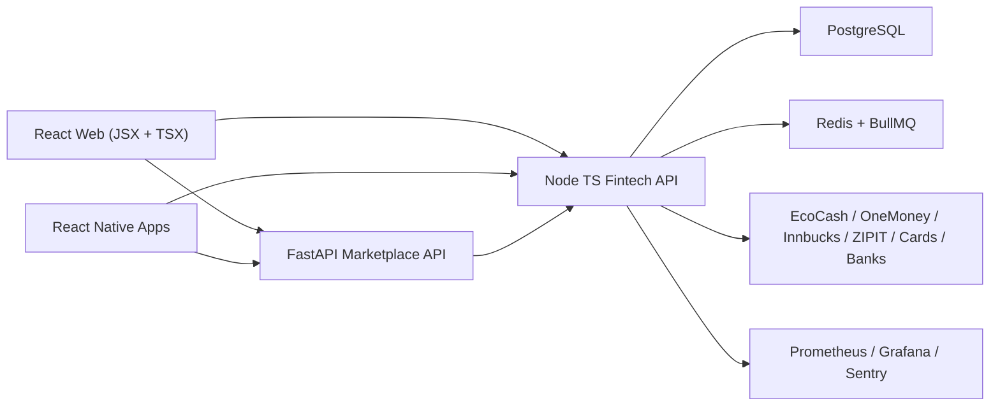
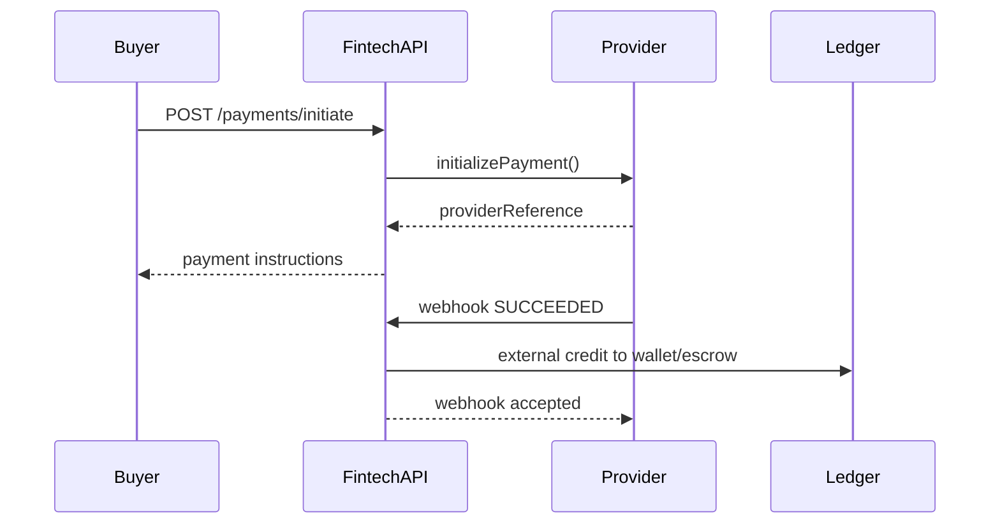

# ZimAgriTrust Enterprise Fintech Architecture

This document defines the enterprise fintech layer added beside the existing agricultural marketplace backend. The goal is gradual modernization: keep the current FastAPI and JSX apps working, while moving payments, wallets, subscriptions, revenue, and settlement into a strongly typed Node.js service.

## Folder Structure

```text
services/fintech-api/
  prisma/schema.prisma
  src/app.ts
  src/main.ts
  src/domain/money.ts
  src/domain/payments/PaymentProviderInterface.ts
  src/domain/payments/providers/*
  src/services/PaymentOrchestrator.ts
  src/services/LedgerService.ts
  src/services/PlatformFeeService.ts
  src/services/SubscriptionService.ts
  src/routes/*
  src/queues/paymentQueue.ts
  src/workers/paymentWorker.ts
  k8s/*
  load-tests/k6-payments.js
```

## System Architecture



## JSX to TSX Migration Strategy

Phase 1 keeps existing JSX running. `allowJs` is enabled in public and admin apps, legacy components remain isolated, and new financial modules are TypeScript.

Phase 2 migrates shared utilities, hooks, API services, and state management to TypeScript. Shared DTOs live under `packages/shared/src/types`.

Phase 3 migrates payment screens, wallet screens, subscription screens, and financial dashboards first. All calculations remain backend-side.

Phase 4 enables stricter TypeScript rules, removes unsafe types, and gradually converts remaining JSX to TSX.

## Payment Orchestration

`PaymentProviderInterface` supports:

- `initializePayment`
- `verifyPayment`
- `processWithdrawal`
- `refundPayment`
- `handleWebhook`
- `getTransactionStatus`

Providers are registered through `ProviderRegistry`, so adding a future provider does not modify core services.



## Wallet and Ledger Rules

The wallet service uses double-entry postings:

- User wallet
- Supplier wallet
- Escrow wallet
- Platform clearing wallet
- Subscription revenue wallet

All transfer endpoints require an `Idempotency-Key`. Ledger postings are immutable journal records. Wallet balances are updated inside database transactions.

## Subscription Engine

Plans:

- Basic
- Pro
- Enterprise

Supported behavior:

- Monthly and annual billing
- Trial periods
- Auto-renew flags
- Grace-period ready schema
- Upgrade, downgrade, cancel
- Invoice creation

## Fee Engine

`PlatformFeeService` calculates:

- Percentage platform fees
- VAT/tax
- Supplier settlement split
- Revenue report totals

Default basis points:

- Basic: 5%
- Pro: 2%
- Enterprise: 1% placeholder until contract pricing is configured

## API Summary

Authentication:

- `POST /api/v1/auth/register`
- `POST /api/v1/auth/login`
- `POST /api/v1/auth/refresh`

Payments:

- `POST /api/v1/payments/initiate`
- `POST /api/v1/payments/webhook/:provider`
- `GET /api/v1/payments/status/:id`
- `POST /api/v1/payments/refund`

Wallets:

- `GET /api/v1/wallets/balance`
- `POST /api/v1/wallets/transfer`
- `POST /api/v1/wallets/withdraw`

Subscriptions:

- `POST /api/v1/subscriptions/create`
- `POST /api/v1/subscriptions/upgrade`
- `POST /api/v1/subscriptions/cancel`

Admin:

- `GET /api/v1/admin/revenue`
- `GET /api/v1/admin/transactions`
- `GET /api/v1/admin/settlements`

## Security Architecture

- JWT access and refresh tokens
- Role-based admin endpoints
- Helmet security headers
- Rate limiting
- Idempotency keys for financial writes
- Password hashing with bcrypt
- Provider webhook isolation
- Audit logs with SHA-256 checksums
- Backend-only financial calculations
- Secrets isolated through environment variables and Kubernetes Secrets

## Observability

- Structured logs with Pino
- `/metrics` endpoint for Prometheus
- Payment attempt counters
- Ledger posting counters
- BullMQ worker logs
- Ready for Grafana, Loki, Sentry, and alert rules

## Docker and Kubernetes

Local development:

```bash
docker compose up fintech-api fintech-worker postgres redis
```

Kubernetes manifests live in `services/fintech-api/k8s`:

- API deployment
- Worker deployment
- Service
- HPA
- ConfigMap
- Secret example

## Production Readiness Checklist for 10k+ Users

1. Confirm PostgreSQL uses managed HA, PITR, read replicas, and daily tested restores.
2. Add PgBouncer for connection pooling.
3. Enable Redis persistence and Sentinel or managed Redis HA.
4. Rotate JWT and webhook secrets through a secret manager.
5. Enforce TLS 1.3 at the ingress and HSTS at the edge.
6. Enable provider webhook signature validation with real provider keys.
7. Run Prisma migrations in a controlled pre-deploy job.
8. Enable Sentry release tracking for API and frontend.
9. Add Grafana alerts for payment failures, ledger mismatch, queue depth, and API p95 latency.
10. Run k6 load tests for 10,000 users and retry-storm scenarios.
11. Reconcile provider statements against `PaymentAttempt`, `Journal`, and `LedgerEntry` daily.
12. Restrict admin APIs by role, MFA, and optionally IP allowlists.
13. Test refunds, partial refunds, withdrawals, escrow release, and settlement rollback paths.
14. Verify mobile and web token handling does not expose refresh tokens in unsafe storage.
15. Validate all financial amounts remain integer minor units, never floats.
16. Configure backup retention and cross-region replication.
17. Confirm DR targets: RTO 30 minutes, RPO 15 minutes.
18. Run OWASP ZAP, dependency audit, and container image scanning.
19. Test queue outage, provider outage, and database failover.
20. Verify audit logs are immutable and exported to cold storage.
21. Complete PCI-DSS readiness review before card processing goes live.
22. Confirm settlement reports match accounting exports.
23. Test admin panel authorization and direct URL blocking.
24. Benchmark API p95 under load below 200ms for read-heavy endpoints.
25. Run fraud scenario tests: duplicate payment, replay webhook, device/IP anomaly, refund abuse.

## Load Testing Strategy

Use `services/fintech-api/load-tests/k6-payments.js` for payment spikes. Run with:

```bash
k6 run -e BASE_URL=https://api.example.com -e ACCESS_TOKEN=... services/fintech-api/load-tests/k6-payments.js
```

Test profiles:

- 10,000 concurrent users
- 1,000 transactions/minute
- Provider timeout storms
- Duplicate webhook replay
- Queue backlog recovery
- Database contention during wallet transfers

## Fraud Prevention Strategy

- Idempotency for write operations
- Duplicate provider reference checks
- KYC gate before withdrawals
- Suspicious activity scoring hook before payouts
- Provider webhook event uniqueness
- Admin approval paths for high-risk refunds
- Audit trail on every admin and financial mutation

## Scaling Recommendations

- Keep the fintech API modular first, then split into payments, wallet, subscription, and settlement services when throughput requires it.
- Use read replicas for dashboards and reports.
- Partition ledger tables by month once transaction volume grows.
- Use queue-based workers for provider callbacks, settlements, reconciliation, and notifications.
- Add provider failover routing once real provider SLAs are known.
